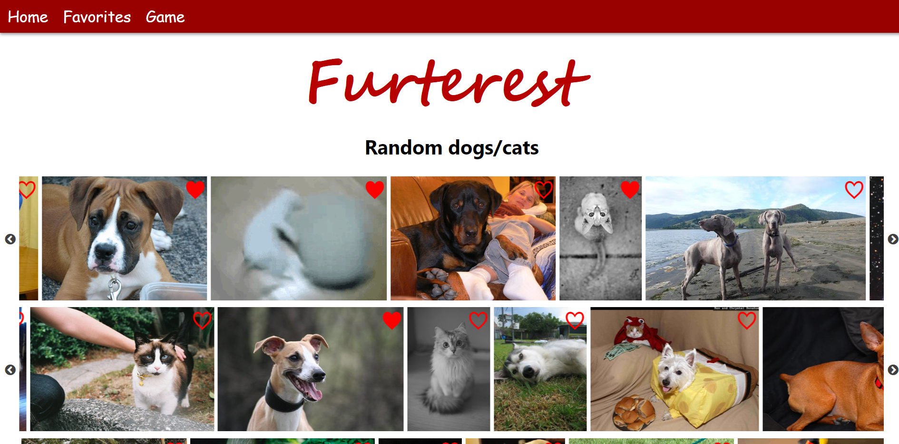

A React application for cat and/or dog lovers. Uses [The Dog API](https://dog.ceo/dog-api/) and [The Cat API](https://thecatapi.com/) to display the most awesome images of the web.

## Pre-requisites

- React
- Prettier

## Installation

Install dependencies

`yarn`

Run development server

`yarn start`

## Application screenshot




## Componentes principales

### `Game`

Controla el flujo general del juego, disparando las acciones correspondientes dentro del `module` `game.js`.

```javascript
class Game extends React.Component {
  constructor(props) {
    ...
  }

  async start() {
    // Comienzo el juego, lanzando la accion startGame
  }

  render() {
    const { playing, endGame, breedsLoaded } = this.props;
    return (
      <div className="game-container">
        <h1 className="title">Let's play!</h1>
        <SelectAnimal />
        <SelectBreed />
        <br />
        <Button
          className="button"
          variant="contained"
          color="primary"
          onClick={this.start}
          disabled={playing || !breedsLoaded}>
          Start
        </Button>
        <Button
          className="button"
          variant="contained"
          color="secondary"
          onClick={endGame}
          disabled={!playing}>
          Done
        </Button>
        {playing ? (
          <h1>Which of these images contains the breed selected ?</h1>
        ) : null}
        <Board />
        <Results />
      </div>
    );
  }
}
```

### `Images`

Componente funcional con estado gracias a *Hooks*. Su función es mostrar las imagenes de gatos y perros, llamando a las acciones `fetchDogs` y `fetchCats`. Tambíen utiliza el componente de librería de terceros `InfiniteScroll` para que carguen más imagenes a medida que se hace *scroll* hacia abajo.


```javascript
const Images = ({ dogs: { dogs }, cats: { cats }, favorites, fetchDogs, fetchCats }) => {
  useEffect(() => {
    fetchDogs();
  }, [fetchDogs]);

  useEffect(() => {
    fetchCats();
  }, [fetchCats]);
  
  const dogImages = dogs.map((dog, index) => {
    const fav = favorites.filter(f => f.id === index).length;
    return <Image animal="dog" key={index} url={dog} id={index} fav={fav > 0}/>;
  });

  const catImages = cats.map(cat => {
    const fav = favorites.filter(f => f.id === cat[1]).length;
    return <Image animal="cat" key={cat[1]} id={cat[1]} url={cat[0]} fav={fav > 0} />;
  });

  const bothImages = [];

  let carouselImages = [];

  for (let i = 0; i < dogImages.length; i++) {
    carouselImages.push(dogImages[i]);
    carouselImages.push(catImages[i]);
    if (carouselImages.length === 18) {
      bothImages.push(carouselImages);
      carouselImages = [];
    }
  }

  const fetchBoth = () => {
    fetchDogs();
    fetchCats();
  };

  return (
    <div className="images">
      <h1>Random dogs/cats</h1>
      <InfiniteScroll
        dataLength={dogImages.length}
        next={fetchBoth}
        hasMore={bothImages.length < 5}
        loader={<h4 key>Scroll down to load more...</h4>}
      />

      {bothImages.map((sliderImages, i) => (
        <Slider
          infinite
          accesibility="false"
          autoplay
          swipeToSlide
          variableWidth
          key={i}>
          {sliderImages}
        </Slider>
      ))}
    </div>
  );
};
```

## Estado

El estado fue dividido en módulos, donde cada uno posee las actions y reducers para trabajar con su estado interno. Por ejemplo, para el estado que almacena las imagenes de los perros:

```javascript
export const GET_DOGS = 'dogs/GET_DOGS';

const initialState = {
  count: 0,
  dogs: []
};

export default (state = initialState, action) => {
  const { payload, type } = action;
  switch (type) {
    case GET_DOGS:
      return {
        ...state,
        dogs: [...state.dogs, ...payload]
      };

    default:
      return {
        ...state
      };
  }
};

export const fetchDogs = () => async dispatch => {
  const response = await fetch(
    'https://dog.ceo/api/breeds/image/random/18'
  ).then(res => res.json());

  const dogs = response.message;

  return dispatch({
    type: GET_DOGS,
    payload: dogs
  });
};
```


## Tests

Se testearon los reducers de los mogulos `dogs.js` y `favorites.js`. Además del componente `Favorite.js`

Para correr los tests:

```
npm test
```
